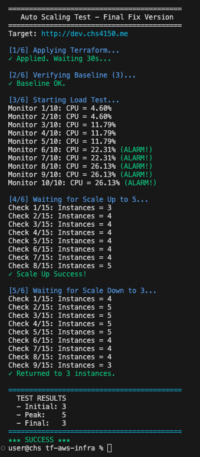

# Product Service - Cloud Infrastructure


**Enterprise-grade cloud infrastructure with auto-scaling, serverless email verification, and comprehensive security**

---

## 📋 Table of Contents

- [Overview](#-overview)
- [Architecture](#-architecture)
- [Quick Start](#-quick-start)
- [Configuration](#-configuration)
- [Testing](#-testing)
- [Security Mechanism](#-security-mechanism)
- [Project Structure](#-project-structure)

---

## 🎯 Overview

Production-ready AWS infrastructure for a RESTful product management service.

### Features

- **High Availability**: Multi-AZ deployment with 3-5 auto-scaling instances
- **Serverless Email**: SNS + Lambda for user verification workflow
- **Security**: KMS encryption, Secrets Manager, private network isolation
- **Zero Downtime**: Rolling updates with health check validation
- **Full Automation**: Terraform IaC with CI/CD pipeline

### Tech Stack

| Layer | Technology |
|-------|------------|
| **Infrastructure** | Terraform (modular, 8 modules) |
| **Compute** | EC2 Auto Scaling, Application Load Balancer |
| **Database** | RDS PostgreSQL 16.3 (encrypted, Multi-AZ ready) |
| **Storage** | S3 (KMS encrypted, lifecycle policies) |
| **Serverless** | Lambda (Python 3.11), SNS |
| **Security** | KMS (4 keys), Secrets Manager, Security Groups |
| **DNS** | Route53 |

**Total**: ~67 AWS resources, ~3,100 lines of Terraform code

---

## 🏗️ Architecture

### High-Level Diagram
```
                          Internet
                             ↓
                    ┌────────────────┐
                    │  Route53 DNS   │
                    └────────┬───────┘
                             │
              ┌──────────────▼──────────────┐
              │ Application Load Balancer   │
              └──────────────┬──────────────┘
                             │
        ┌────────────────────┼────────────────────┐
        │                    │                    │
   ┌────▼────┐          ┌────▼────┐          ┌────▼────┐
   │ EC2 (1a)│          │ EC2 (1b)│          │ EC2 (1c)│
   └────┬────┘          └────┬────┘          └────┬────┘
        │                    │                    │
        └────────────────────┼────────────────────┘
                             │
                    ┌────────┴─────────┐
                    ↓                  ↓
            RDS PostgreSQL         S3 Bucket
            (Private Subnet)       (Images)

Email Flow: EC2 → SNS → Lambda → Mailgun → User
```

### Modules
```
networking  → VPC, 6 subnets (3 AZs), 3 security groups
security    → 4 KMS keys, 3 secrets (DB, Mailgun)
database    → RDS PostgreSQL 16.3, encrypted, backups
storage     → S3 bucket, KMS encryption, lifecycle
serverless  → SNS topic, Lambda (email handler)
compute     → ASG (3-5 instances), ALB, scaling policies
dns         → Route53 A record (alias to ALB)
```

---

## 🚀 Quick Start

### Prerequisites

- Terraform >= 1.5.0, AWS CLI >= 2.0
- AWS account with `dev` profile configured
- Domain with Route53 hosted zone
- Mailgun account (API key required)
- EC2 key pair created

### Deploy
```bash
# 1. Configure
cp terraform.tfvars.example terraform.tfvars
vim terraform.tfvars  # Set: domain_name, mailgun_api_key, key_name

# 2. Create Lambda placeholder
mkdir -p /tmp/lambda && cd /tmp/lambda
echo 'def lambda_handler(e,c): return {"statusCode":200}' > email_handler.py
zip lambda_placeholder.zip email_handler.py
cp lambda_placeholder.zip <tf-aws-infra-path>/

# 3. Deploy infrastructure
cd <tf-aws-infra-path>
terraform init
terraform plan
terraform apply  # ~10-15 minutes
```

### Verify
```bash
terraform output application_url
curl $(terraform output -raw application_url)/health
```

---

## ⚙️ Configuration

### Required Variables
```hcl
# terraform.tfvars
domain_name     = "dev.yourdomain.com"  # Your Route53 domain
mailgun_api_key = "your-api-key"        # From Mailgun dashboard
key_name        = "your-keypair"        # EC2 key pair name
```

### Optional Tuning
```hcl
# Auto Scaling
asg_min_size = 3  # Min instances
asg_max_size = 5  # Max instances

# Database
db_instance_class = "db.t3.micro"
db_allocated_storage = 20  # GB

# Compute
instance_type = "t2.micro"
```

### Multi-Environment
```bash
# Use different tfvars for each environment
terraform apply -var-file="environments/dev.tfvars"
terraform apply -var-file="environments/demo.tfvars"
```

---

## 🧪 Testing

### Auto Scaling Test

<div align="center">

</div>

**Results:**
- ✅ Baseline: 3 instances
- ✅ Load applied (CPU 22-26%) → Scaled to 5 instances in ~2 min
- ✅ Load removed (CPU 4-11%) → Scaled to 3 instances in ~3 min
- ✅ Zero downtime during scaling

**Run test:**
```bash
bash scripts/test_autoscaling.sh
```

### Email Verification
```bash
# Register user (triggers email)
curl -X POST http://dev.chs4150.me/v1/user \
  -H "Content-Type: application/json" \
  -d '{"email":"test@example.com","password":"Pass123!","firstName":"John","lastName":"Doe"}'

# Check Lambda logs
aws logs tail /aws/lambda/product-service-dev-email-handler --follow

# Verify account (click link in email within 1 minute)
```

---

## 🔒 Security Mechanism

### Encryption

| Resource | Method | Key |
|----------|--------|-----|
| RDS Database | AES-256 | KMS (auto-rotate) |
| S3 Bucket | SSE-KMS | KMS (auto-rotate) |
| EBS Volumes | AES-256 | KMS (auto-rotate) |
| Secrets | AES-256 | KMS (auto-rotate) |

### Network Isolation

- RDS in private subnets (no internet)
- S3 public access blocked
- EC2 only accessible via ALB
- Security groups: least-privilege rules

### Secrets Management

Stored in AWS Secrets Manager (KMS encrypted):
- `product-service/dev/rds/password` (auto-generated)
- `product-service/dev/email/mailgun-api-key`
- `product-service/dev/email/mailgun-domain`

### Implementation

- 🔐 **Use personal credentials**
  - Update with AWS credentials, Mailgun API key, domain name

- 🔄 **Rotate all secrets for production**
  - database passwords
  - API keys
  - AWS Secrets Manager rotation features

- 🚧 **Production security hardening**
  - Restrict SSH access to specific IP ranges (currently open to 0.0.0.0/0)
  - Enable AWS WAF on Application Load Balancer
  - Enable MFA for AWS account
  - Review and minimize IAM permissions
  - Enable CloudTrail for audit logging

---

## 📂 Project Structure
```
tf-aws-infra/
├── main.tf                      # Module orchestration
├── variables.tf                 # Global variables
├── outputs.tf                   # Exported values
├── modules/                     # 8 infrastructure modules
│   ├── networking/              # VPC, subnets, security groups
│   ├── security/                # KMS, Secrets Manager
│   ├── database/                # RDS PostgreSQL
│   ├── storage/                 # S3 bucket
│   ├── serverless/{sns,lambda}/ # SNS + Lambda
│   ├── compute/                 # EC2, ALB, Auto Scaling
│   └── dns/                     # Route53
└── scripts/                     # user-data.sh, test scripts
```

**Stats**: 46 files, ~3,100 lines, ~67 AWS resources

---

## 🔧 Maintenance

### Update Infrastructure
```bash
terraform plan    # Preview changes
terraform apply   # Apply changes
```

### Update Application

**Automated**: Push to GitHub → CI/CD builds AMI → Instance refresh → Zero downtime

### Backups

- RDS: Daily automated backups (7-day retention)
- Backup window: 03:00-04:00 UTC
- Restore: `aws rds restore-db-instance-from-db-snapshot`

---

## 💰 Cost Estimate

**Monthly cost (us-east-1, dev environment): ~$60**

| Service | Cost |
|---------|------|
| EC2 (3× t2.micro) | ~$25 |
| RDS (db.t3.micro) | ~$15 |
| ALB | ~$18 |
| Other (S3, Lambda, Secrets) | ~$2 |

**Optimizations**: Auto-scaling, S3 lifecycle, KMS bucket keys

---

## 🐛 Troubleshooting

**EC2 Unhealthy?** Check logs: `/var/log/user-data.log`, `sudo journalctl -u csye6225.service`

**Lambda Not Triggered?** Verify SNS subscription: `aws sns list-subscriptions-by-topic`

**RDS Connection Failed?** Check secrets: `aws secretsmanager get-secret-value --secret-id product-service/dev/rds/password`

---

**Built with Terraform · Deployed on AWS · Monitored with CloudWatch**